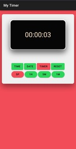
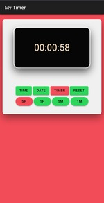
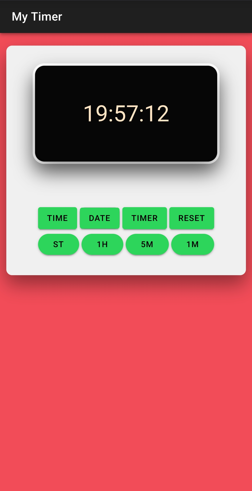
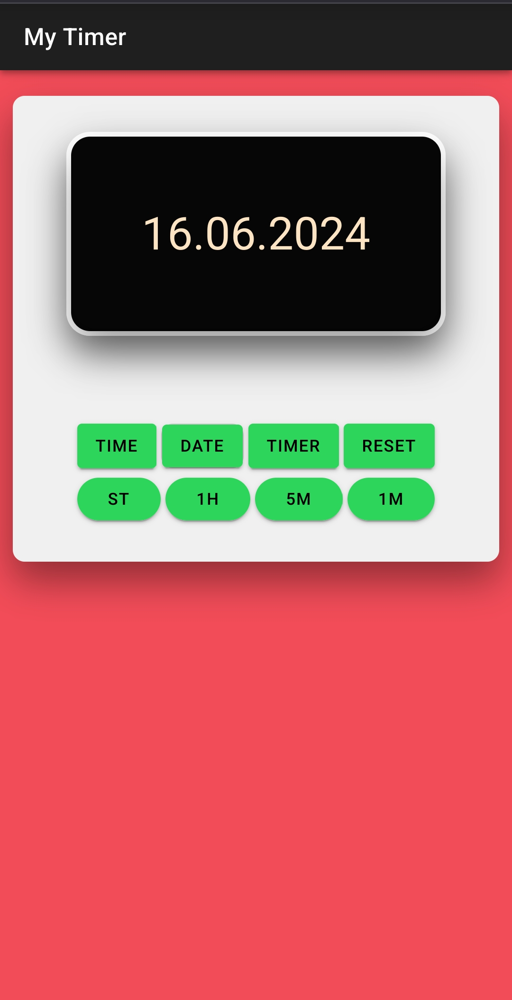

# myTimer Project: V1

## Overview
This project contains:

1. **Timer Functionality**: Set a specific time, and the timer will count down to zero.
    - **Features**:
        - **Function**: Counting down
        - Click the **Timer** button to start Timer mode.
        - Enter the time by clicking the time buttons such as 1H, 5M, 1M, 5S, 1S.
        - Click **ST** to start and **SP** to stop.
        - Click **Reset** to start again from zero or click **Timer** to end Timer mode.
    - 

2. **Stopwatch Functionality**: Start the time, and the stopwatch will count up.
    - **Features**:
        - **Function**: Counting up
        - Click the **Timer** button to start Timer mode.
        - Click the **ST** button to start counting up.
        - Click the **SP** button to stop counting up.
        - Click the **Reset** button to set the timer back to zero.
        - Click **Timer** to end Timer mode.
    - 

3. **Time Display**: Shows the current time.
    - 

4. **Date Display**: Shows the current date.
    - 

## Additional Features
- The App design is responsive for many different devices
- The app supports vibration when clicking buttons.
- The app supports vibration when the timer ends.
- The app supports sound when the timer ends.
- When the timer ends, you can stop the sound and vibration by clicking any button.
- In order not to accidentally end the timer, it is blocked from changing to time or date as long as the timer is still running.
- The version of the app is attached in this folder. feel free to install the app on your device.

## Bug
- The app doesn't run in Background when screen is off.

