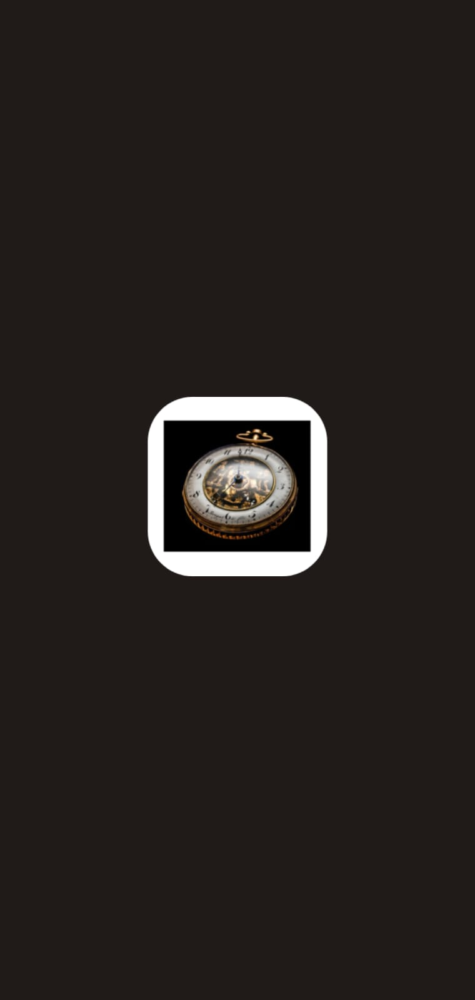
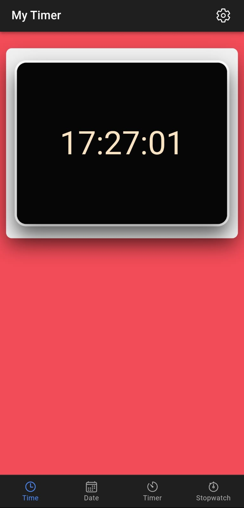
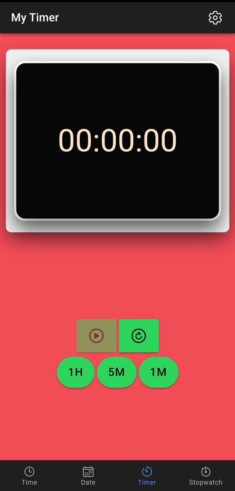
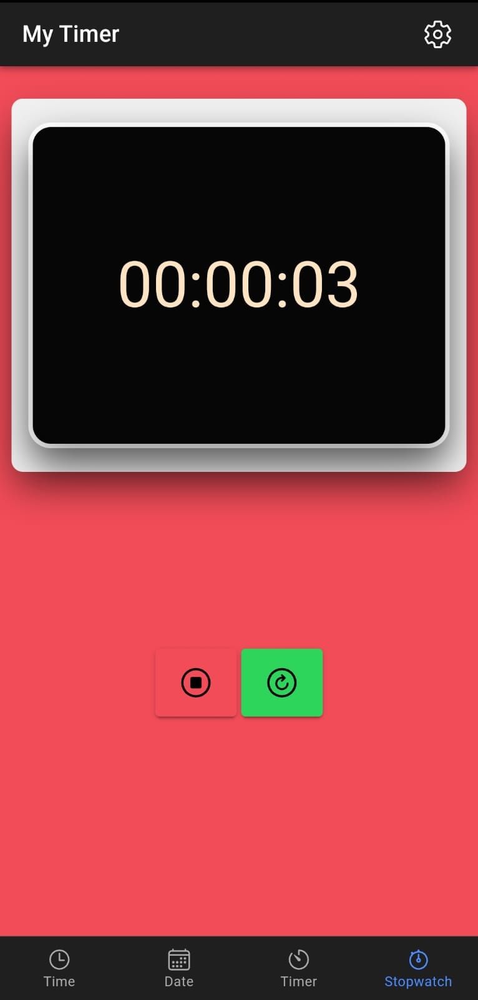
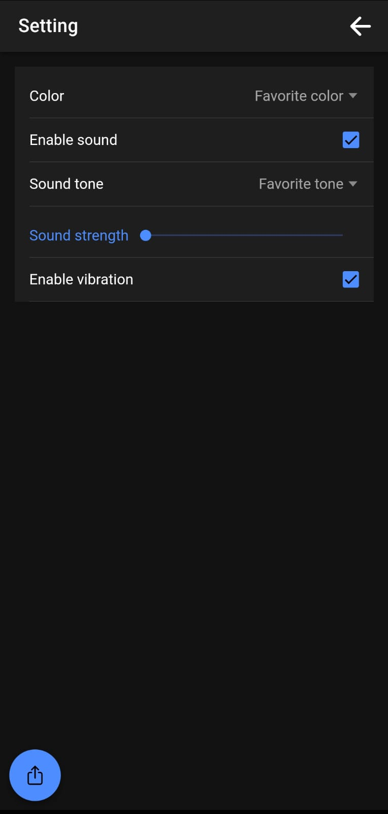
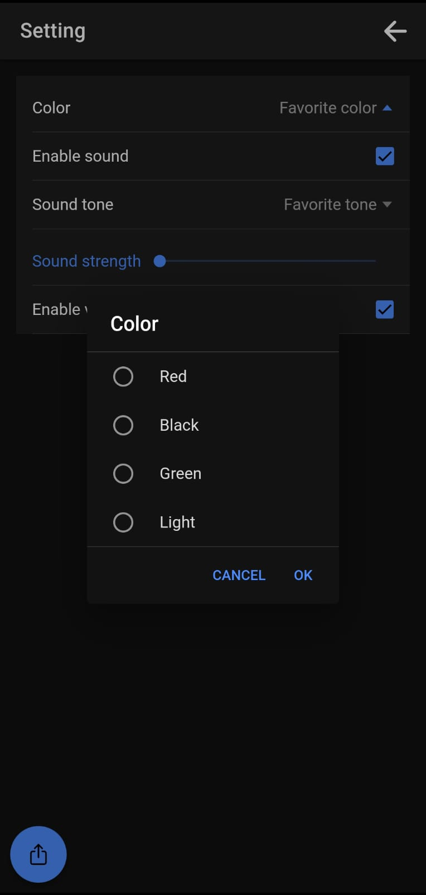
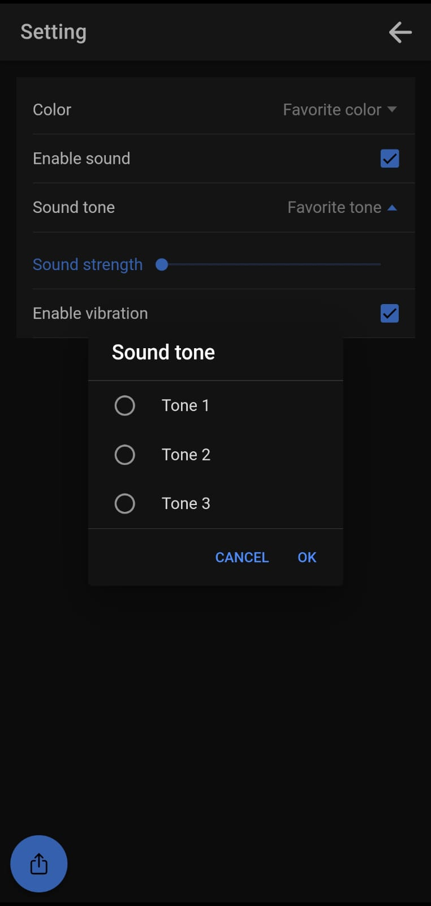
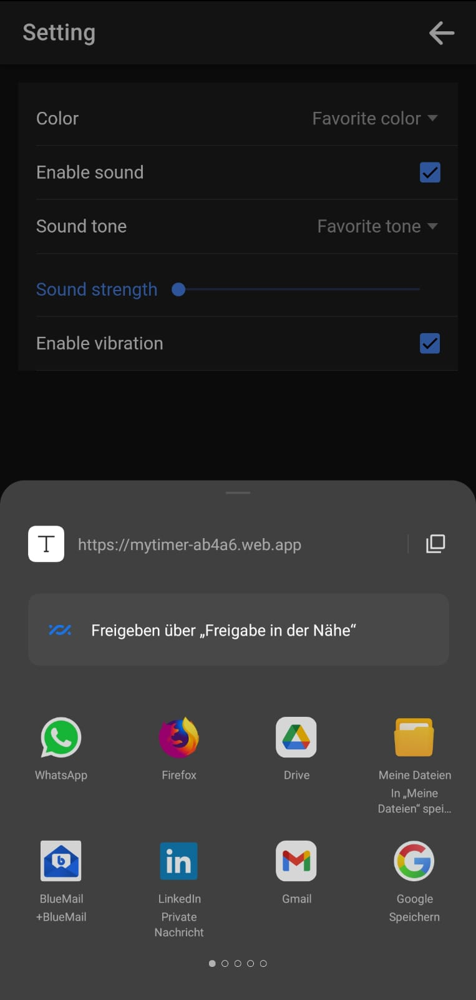

# MyTimer App – Ionic + React

A customizable timer app built with [Ionic Framework](https://ionicframework.com/) and React, featuring sound and vibration notifications, multilingual support, theming, and Firebase integration.

## 🚀 Getting Started

### Prerequisites

Make sure you have the following installed:

- [Node.js](https://nodejs.org/) (v12 or higher)
- [npm](https://www.npmjs.com/) (usually comes with Node.js)
- [Ionic CLI](https://ionicframework.com/docs/cli)
- [Android Studio](https://developer.android.com/studio)

### Installation

```bash
npm install -g @ionic/cli
npm install
npm install @capacitor/android
```

### Running the App
```bash
cd myTimer
ionic build
ionic serve               # or: ionic serve --browser="msedge"
```

### Android Setup
```bash
npx cap init [appName] [appId]    # Only if not initialized
npx cap add android               # Add Android platform
npx cap copy android              # Copy build files to Android project
ionic cap sync                    # Sync plugins and platform
ionic capacitor run android       # Run on emulator or connected device
```

### Common Issues

- JAVA_HOME not set properly:
```bash
    set JAVA_HOME="C:\Program Files\Java\jdk-<version>"
```
- ADB Problems:
```bash
cd %LOCALAPPDATA%\Android\Sdk\platform-tools
adb kill-server
adb start-server
```

### 🔌 Plugins
```bash
npm install @capacitor/haptics        # Recommended: Capacitor Haptics for vibration
npm install cordova-plugin-media      # For media playback (deprecated but used)
```

### ✅ Task List

Completed Tasks

    ✅ Add Icons

    ✅ Upload App to Firebase Hosting

    ✅ Responsive Layout

    ✅ Vibration + Sound Integration

    ✅ File Restructure

    ✅ Modal Settings (Sound/Vibration toggles, Color selection)

    ✅ Share / Copy Download Link

In Progress / Planned

    ⏳ Sound Selection UI

    ⏳ Language Switcher

    ⏳ News Modal

    ⏳ Work Time Tracker

    For more tasks, check the Issues.

### 🐛 Known Bugs

    ❗ Timer does not work when the display is off (background limitation)


### 📸 Screenshots
### 📸 Screenshots
  
  
  
  
  
  
  
  
  
